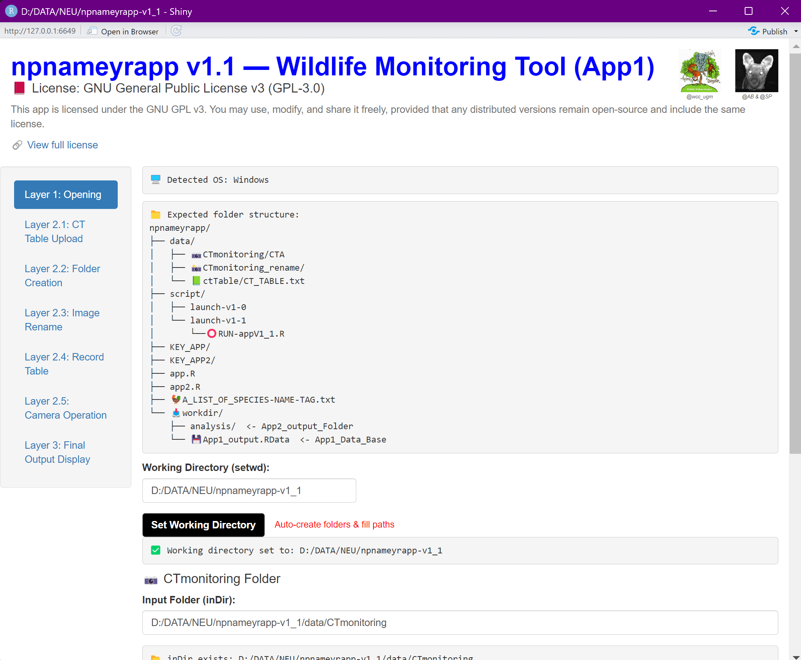
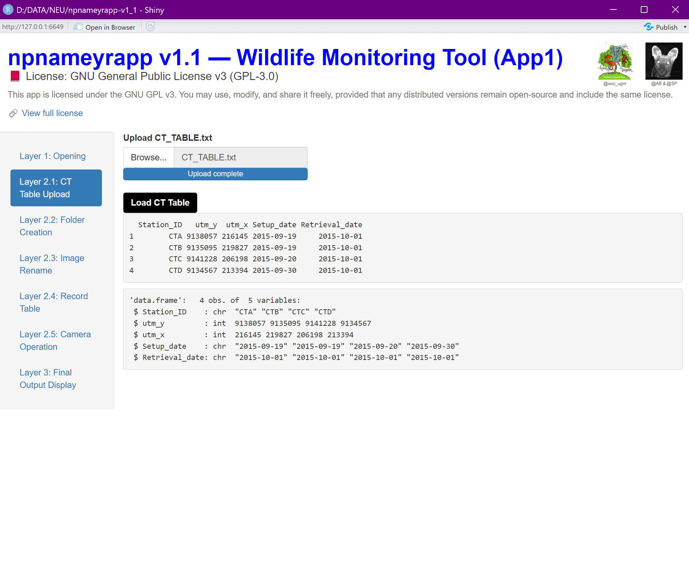
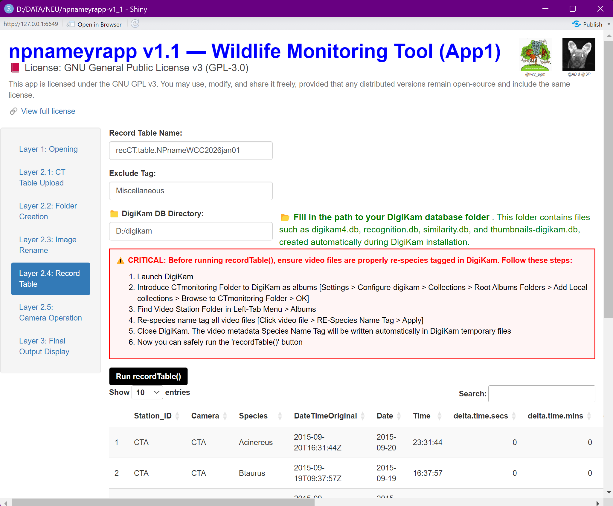
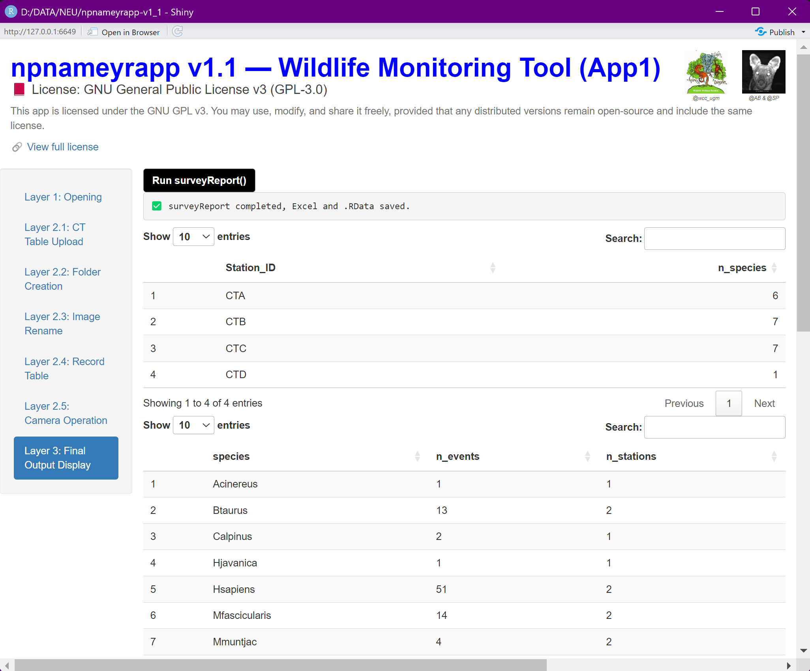
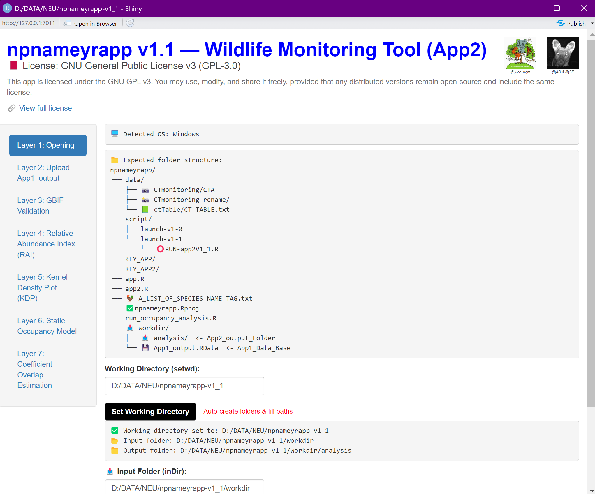
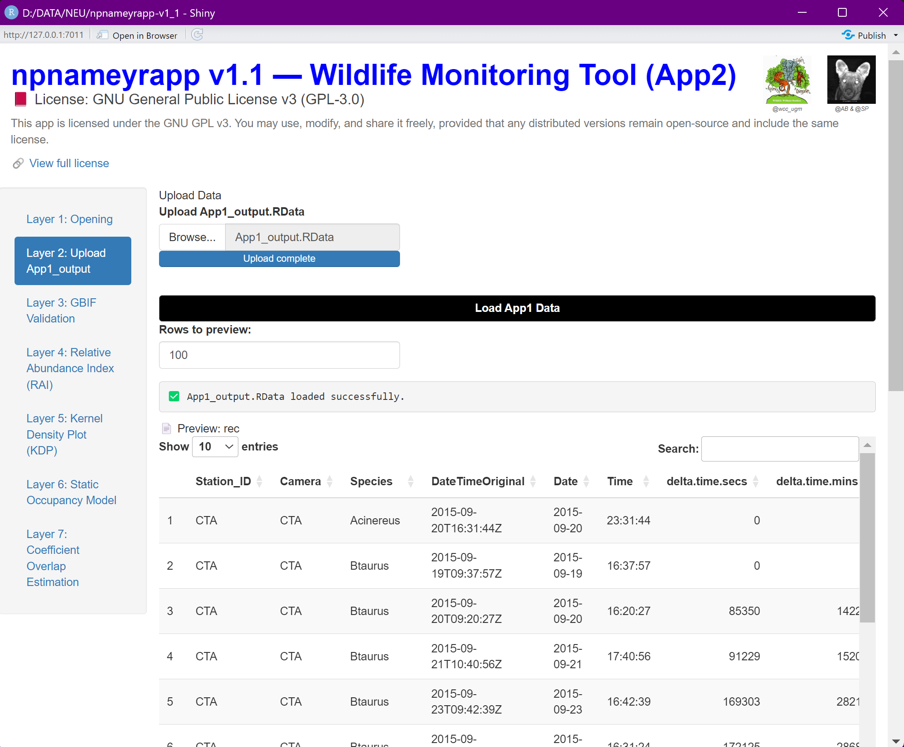
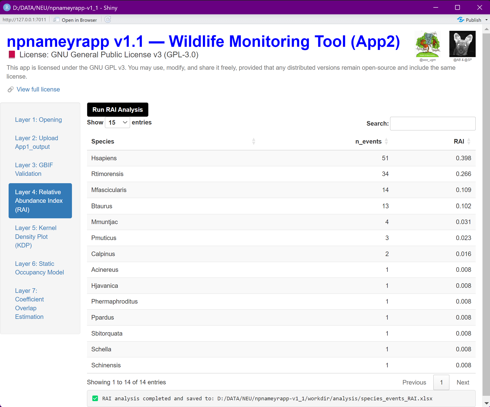
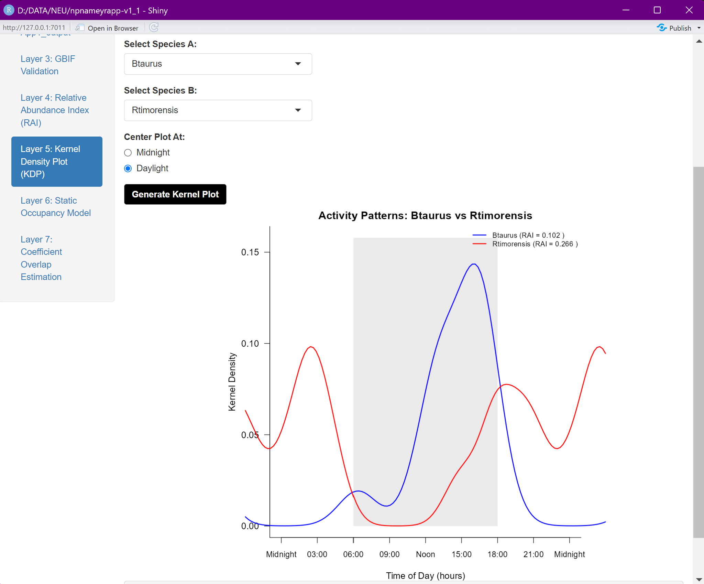
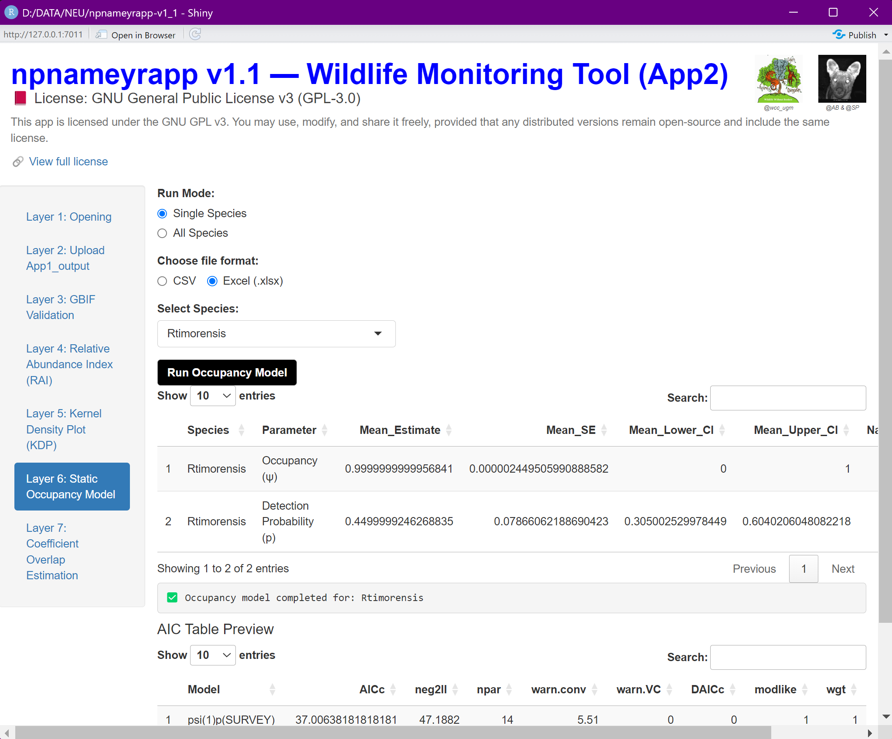
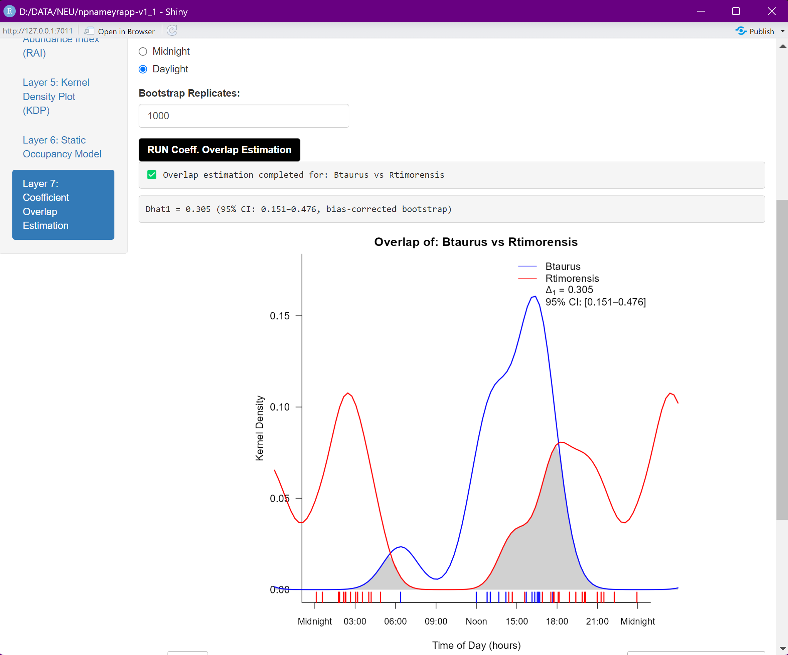

# npnameyrapp  
- Modular Shiny app for wildlife monitoring workflows (App1 & App2)  
=======  

# npnameyrapp v1.1  
**Authors:** Arief Budiman & Satyawan Pudyatmoko  
**Date:** 2026‑01‑01  

**Keywords:** Auto‑folder creation, Image + Video integration (Hybrid CT data), Data preview, Species‑input auto‑fill, GBIF validation, Activity overlap plots, Overlap coefficient estimation, Bootstrap customization, Confidence intervals, Automatic package check, Startup experience, User‑friendly onboarding

## 📖 Overview

**npnameyrapp** is an interactive Shiny application designed to support National Park and protected-area staff in managing and preparing wildlife monitoring databases, particularly camera trap data.

The development of **npnameyrapp v1.1** was **directly shaped by collaboration and field-based contributions** from the **Wildlife Conservation Centre (WCC), Universitas Gadjah Mada**, as well as park staff, users, and practitioners involved in the activity *“Camera Trap Data Management Using the npnameyrapp v1.0-master Application”*, held at **Baluran National Park, Situbondo, East Java (5 December 2025)**. Feedback from this activity informed both design decisions and feature priorities in the current version.

WCC UGM also supported the **public launch** of the application through their official website [official website](https://satwaliar.fkt.ugm.ac.id/2025/12/25/app-launch-npnameyrapp-untuk-monitoring-satwa-liar/), contributing institutional backing and facilitating wider dissemination. Real-world use cases, operational constraints, and practitioner feedback were essential in refining workflows, improving usability, and expanding functionality from v1.0 to v1.1.  

As a **community-driven, open-source project**, npnameyrapp grows through shared experience between developers, conservation practitioners, and researchers. Field insights and practical challenges reported by users play a central role in ensuring the application remains relevant, robust, and responsive to conservation monitoring needs. 

We welcome contributions in many forms—including **code development, documentation, testing, feature suggestions, and field feedback**. Whether you are a ranger, researcher, student, or developer, your contributions help strengthen wildlife monitoring capacity and support evidence-based decisions for species persistence and ecosystem resilience. 

---

## System Requirements & Recommended Tools  

To run **npnameyrapp v1.1**, we recommend the following environment and supporting tools:

- **R base 4.3.3** (recommended version)  
- **RStudio Desktop 2025**  
- **digiKam 8.3.0**  
- **RTools 4.3**  
- **ExifTool** (for reading and writing image/video metadata)

### 📥 Download Links  
- [R base 4.3.3](https://cran.rstudio.com/bin/windows/base/old/4.3.3/)  
- [RStudio Desktop](https://posit.co/download/rstudio-desktop/)  
- [digiKam 8.3.0](https://www.digikam.org/download/)  
- [RTools 4.3](https://cran.r-project.org/bin/windows/Rtools/rtools43/rtools.html)  
- [ExifTool](https://exiftool.org/install.html) – required for handling metadata in images and videos  

---

### 🚀 Quick Start
1. Clone this repository or download the source.
2. Open `npnameyrapp.Rproj` in RStudio.
3. R will automatically check required packages (✔ loaded / ❌ missing).
4. If packages are missing, follow the install instructions shown in the console.
5. Once all packages are loaded successfully, run:
   ```r
   source("RUN_appv1.1.R")
6. The Shiny app will launch in your browser.


### 📝 What happens when you launch
- You’ll see a welcome message and package check.
- ✔ means the package is loaded successfully.
- ❌ means the package is missing, with install instructions.
- ⚠️ Important: The app will only run after all packages are installed.


## 📝 Example Console Output

- 🎉 Welcome to Shiny App v1.1  
- 🔧 Checking required packages for App1 and App2...  
- ➡ Loading package: shiny  
  - ✔ Package 'shiny' loaded successfully.  
- ➡ Loading package: janitor  
  - ❌ Package 'janitor' is not installed.  
  - To install, run: `install.packages("janitor")`  
- ⚠️ The following packages are missing and need to be installed:  
  - janitor  
- 💡 Please install them using the commands shown above, then restart R.  
- 📋 Package check completed at: 2026-01-01 10:30:00

---

## Download npnameyrapp v1.1‑master  

- **Archived DOI Snapshot (for reproducibility):**
  [Download from Zenodo](https://zenodo.org/records/18110181)  
  DOI: [10.5281/zenodo.18110181](https://doi.org/10.5281/zenodo.18110181)  

- **Latest Development Version (always up to date):**  
  [Download from master branch](https://github.com/ariefalpinus/npnameyrapp/archive/refs/heads/master.zip)  
  This version includes recent corrections to kernel plot axis logic, clock labels, and daylight shading.  

**Note:**  
- Use the **Archived DOI Snapshot** for reproducibility and citation.  
- Use the **GitHub Release** for stable deployment.  
- Use the **Latest Development Version** to get the most recent updates.  
- For workflows involving video files, please read the *Critical Steps* section before launching App1.  

## 📌 How to Cite
Budiman, A., & Pudyatmoko, S. (2026). *npnameyrapp: A Shiny App for Wildlife Monitoring* (v1.1-master) [Software]. Zenodo. https://doi.org/10.5281/zenodo.18110181

---

# Upgrade npnameyrapp v1.0 → v1.1  

## What’s New  

Version 1.1 introduces workflow automation, improved usability, and expanded analytical features.  
Many of these updates were informed by real-world use cases and feedback from practitioners during field-based training and deployment.

---

### App1  — Data Preparation & Table Construction

- **Auto-folder creation**  
  Automatically generates the required folder structure and input paths, reducing manual setup and path errors.

- **Image + Video integration (Hybrid CT data)**  
  Supports combined processing of image and video files when building camera trap tables, enabling more flexible workflows.

---

### App2  — Analysis & Interpretation

- **Auto-folder creation**  
  Automatically creates its own working directories and input paths for downstream analyses.

- **Data preview**  
  Allows previewing **100–1000 rows** of processed data from App1 before analysis.

- **Species-input auto-fill**  
  Automatically populates the *Species-input* column using the species tag list, supporting standardized naming and **GBIF validation**.

- **Activity overlap plots (two species)**  
  Adds an option to visualize daily activity overlap between two selected species.

- **Overlap coefficient estimation**  
  Estimates overlap coefficients for a single species pair, using automatic estimator selection and confidence interval methods.

- **Bootstrap customization**  
  Allows users to define the number of bootstrap iterations (**1,000–10,000**) and generates a summary table of confidence intervals.

---

### General Improvements  

- **Automatic package check at startup**  
  When opening the project in RStudio, npnameyrapp v1.1 automatically checks whether all required packages for App1 and App2 are available.

  - ✅ No manual setup required if all packages are already installed  
  - ❌ Clear installation instructions are shown in the console if packages are missing  
  - ⚠️ RStudio opens normally even when packages are missing  
  - 📋 Step-by-step console messages guide users until completion, ending with:  
    *“All packages are ready. You can now launch the app.”*

---

### 🔑 Keywords  
**Auto‑folder creation, Image + Video integration (Hybrid CT data), Data preview, Species‑input auto‑fill, GBIF validation, Two-species Activity overlap plots, Overlap coefficient estimation, Bootstrap customization, Confidence intervals, Automatic package check, Startup experience, User‑friendly onboarding**

---

<p align="center">

  <!-- Project Status -->
  

  <!-- License -->
  

  <!-- Stars -->
  

  <!-- Forks -->
  

  <!-- Issues -->
  

  <!-- Repo Size -->
  

  <!-- Hits counter -->
  

  <!-- Source Archive (always updated) -->
  <a href="https://github.com/ariefalpinus/npnameyrapp/archive/refs/heads/master.zip">
    
  </a>
  
  <!-- Release Asset (counted downloads, if uploaded) -->
  <a href="https://github.com/ariefalpinus/npnameyrapp/releases/download/v1.1-master/npnameyrapp-v1.1-master.zip">
  
</a>

<!-- DOI (Zenodo) -->
<a href="https://doi.org/10.5281/zenodo.18110181">
  
</a>

</p>

---

## Contents
- [Introduction](#introduction)
- [Download & Extract ZIP File](#download--extract-zip-file)
- [Launch App](#launch-app)
- [Running the Application](#running-the-application)
  - [⚠️ Critical Steps for Video Files](#️-critical-steps-for-video-files)
- [Folder Structure](#folder-structure)
- [Troubleshooting](#troubleshooting)
- [References](#references)
- [License](#license)
- [Version History](#version-history-appendix-updated-with-release-date)

---

## Introduction
The **npnameyrapp** application was developed to help National Park staff (or staff of other protected areas) carry out wildlife monitoring tasks using camera traps—especially for staff who are not yet familiar with R coding.  

It provides a partially interactive interface that implements workflows from:  
- **camtrapR** ([CRAN link](https://cran.r-project.org/web/packages/camtrapR/)) for processing raw field data into tabulated record tables.  
- **overlap** ([CRAN link](https://cran.r-project.org/web/packages/overlap/)) for analyzing species daily activity patterns.  
- **RPresence** (`install.packages('RPresence', repos='https://www.mbr-pwrc.usgs.gov/mbrCRAN')`) for static occupancy analysis (single species – single season).  

The application consists of two sub-applications run separately and sequentially:  
- **App1** ("script/launch-v1-1/RUN-appV1_1.R")  
- **App2** ("script/launch-v1-1/RUN-app2V1_1.R")  

**Inputs:**  
- App1 requires two datasets: `data/CTmonitoring` and `data/ctTable`.  
- App2 requires one input file: `App1_output.RData` (generated by App1).   

---

## Download & Extract ZIP File
Download `npnameyrapp-master.zip`, then extract it into `C:/Users/ACER` (or any folder of your choice).  

Open `npnameyrapp.Rproj` to launch RStudio with the working directory set to:  

C:/Users/ACER/npnameyrapp

---

## Launch App
Open `script/launch-v1-1/RUN-appV1_1.R` in RStudio and execute each line (`Ctrl + Enter`). 

The script is divided into three parts:  
1. **Working Directory** – `getwd()` ensures the directory is `C:/Users/ACER/npnameyrapp`.  
2. **Packages** – `library()` loads required R packages.  
3. **App Launcher** –  
   ```r
   source("KEY_APP2/launch-app.R")    # initializes the application 1
   source("KEY_APP2/launch-app2.R")   # initializes the application 2

   shinyApp(ui, server)             # opens the app
  
> The procedure for launching App1 and App2 is the same.

---

## Running the Application

Both applications contain several “layers” grouped into two categories:

1. **USER-INPUT layers**
2. **USER-PROCESSING layers**

---

### App1

#### USER-INPUT Layers

**Opening**
- `setwd()` – confirm the working directory  
- `inDir` – `<working_directory>/data/CTmonitoring`  
- `outDir` – `<working_directory>/data/CTmonitoring_rename`  
- `excel_outdir` – `<working_directory>/workdir`  
- **EXIFTOOL Path** – folder containing `exiftool.exe` (e.g., `C:/Windows`)  

**Fig 1. App1 — Opening (layer input: PATH)**  


**CT Table Upload**
- Browse to `CT_TABLE.txt` located in `<working_directory>/data/ctTable`  

**Fig 2. App1 — Upload CT_TABLE.txt (layer input)**  


#### Outputs (saved to `excel_outdir`)
- Record Table  
- Camera Operation Matrix  
- Survey Report  
- `App1_output.RData`  

**Fig 3. App1 — Record_Table (layer processing result)**  


**Fig 4. App1 — SurveyReport (layer processing result)**  


---

### App2

#### USER-INPUT Layers

**Opening**
- `setwd()` – confirm the working directory  
- `inDir` – `<working_directory>/workdir`  
- `outDir` – `<working_directory>/workdir/analysis`  

**Fig 5. App2 — Opening (layer input: PATH)**  


**Upload App1_output**
- Browse to `App1_output.RData` located in `<working_directory>/workdir`  

**Fig 6. App2 — Upload App1_output.RData (layer input)**  


#### Outputs (saved to `outDir`)
- GBIF validation table  
- RAI table  
- Kernel Density Plot (PNG, 600 dpi resolution)  
- Static Occupancy Table 
- Overlap coefficient plot with confidence interval
- Summary table of confidence intervals 

**Fig 7. App2 — GBIF Validation (layer processing result)**  


**Fig 8. App2 — Relative Abundance Index (layer processing result)**  


**Fig 9. App2 — Kernel Density Plot (layer processing result)**  


**Fig 10. App2 — Static Occupancy Model (layer processing result)**  


**Fig 11. App2 — Overlap Plot with CI  (layer processing result)**  


---

### ⚠️ Critical Steps for Video Files

If your **CT Data Folder contains video files**, you **must** follow this sequence before launching the app:

1. **Extract the ZIP file** to set up the expected folder structure.  
2. **Introduce `CTmonitoring` folder to DigiKam as albums**  
   - Install and launch DigiKam.  
   - Go to **Settings → Configure DigiKam → Collections → Root Albums Folders**.  
   - Add local collection → Browse to `CTmonitoring` folder → OK.  
3. **Re‑species name tag all video files**  
   - In DigiKam’s left tab menu → Albums → select the video station folder.  
   - Apply correct species name tags to all video files → click **Apply**.  
4. **Find and note the DigiKam database path**  
   - Go to **Settings → Configure DigiKam → Collections → Database**.  
   - Copy the path (e.g., `D:\digikam`).  
   - This folder contains:  
     - `digikam4.db`  
     - `recognition.db`  
     - `similarity.db`  
     - `thumbnails-digikam.db`  
5. **Close DigiKam**  
   - The species name tags will be written automatically into DigiKam’s temporary files.  
6. **Launch the app safely**  
   - Now you can run the app with video included.  

> **✅ Why this is important**  
> - Ensures **species metadata is correctly embedded** in video files before the app processes them.  
> - Prevents errors when `recordTable()` reads video metadata.  
> - Keeps the workflow reproducible for both old and new users.  

---

## Folder Structure

**Fig 12. Expected Folder Structure**  


---

## Troubleshooting
Problem-solving discussions take place in the Google Group:
npshinyapp@googlegroups.com
All answers and troubleshooting guidance will be shared through this group.
Users may register or send an email address to be added as a member.

---

## References
- R Core Team. (2024). *R: A Language and Environment for Statistical Computing*. R Foundation for Statistical Computing, Vienna, Austria. [https://www.R-project.org/](https://www.R-project.org/)  
- Pudyatmoko, S., Budiman, A., & Siregar, A. H. (2023). *Habitat suitability of a peatland landscape for tiger translocation on Kampar Peninsula, Sumatra, Indonesia*. [https://doi.org/10.1007/s42991-023-00361-8](https://doi.org/10.1007/s42991-023-00361-8)  
- Pudyatmoko, S. (2017). *Free range livestock influence species richness, occupancy, and daily behaviour of wild mammalian species in Baluran National Park, Indonesia*. *Mammalian Biology*, 86, 33–41. [https://doi.org/10.1016/j.mambio.2017.04.001](https://doi.org/10.1016/j.mambio.2017.04.001)  
- Chang, W., Cheng, J., Allaire, J., Sievert, C., Schloerke, B., Xie, Y., Allen, J., McPherson, J., Dipert, A., & Borges, B. (2024). *shiny: Web Application Framework for R*. R package version 1.10.0. [https://CRAN.R-project.org/package=shiny](https://CRAN.R-project.org/package=shiny)  
- Niedballa, J., Sollmann, R., Courtiol, A., & Wilting, A. (2016). *camtrapR: An R package for efficient camera trap data management*. *Methods in Ecology and Evolution*, 7(12), 1457–1462.  
- Meredith, M., Ridout, M., & Campbell, L. A. (2024). *overlap: Estimates of Coefficient of Overlapping for Animal Activity Patterns*. R package version 0.3.9. [https://CRAN.R-project.org/package=overlap](https://CRAN.R-project.org/package=overlap) 
- Meredith, M., & Ridout, M. (2016). *Overview of the overlap package*. R package vignette. [https://CRAN.R-project.org/package=overlap](https://CRAN.R-project.org/package=overlap)   
- MacKenzie, D., & Hines, J. (2025). *RPresence: R Interface for Program PRESENCE*. R package version 2.15.20.  

---

## License
This project is licensed under the GNU GPL v3.0.  
See [LICENSE.md](LICENSE.md) for details. 

---

### Version History Appendix (updated with release date)

| Version | Date       | Key Features |
|---------|------------|--------------|
| **v1.0** | 2025‑11‑20 | Initial release. Stable workflows for camera trap data (images only). Includes kernel plot axis corrections, clock labels, daylight shading. DOI: [10.5281/zenodo.17725255](https://doi.org/10.5281/zenodo.17725255) |
| **v1.1** | **2026‑01‑01** | **Auto‑folder creation (App1 & App2)**, **Image + Video integration**, **Data preview (100–1000 rows)**, **Species‑input auto‑fill for GBIF validation**, **Activity overlap plots**, **Overlap coefficient estimation with automatic CI method**, **Bootstrap customization (1000–10000 runs)**. DOI:  [10.5281/zenodo.18110181](https://doi.org/10.5281/zenodo.18110181)

---

