# npnameyrapp
- Modular Shiny app for wildlife monitoring workflows (App1 &amp; App2)
=======
# npnameyrapp v1.0
**Authors:** Arief Budiman & Satyawan Pudyatmoko  
**Date:** 2025-11-20  

An interactive Shiny application to help National Park staff manage and prepare wildlife monitoring databases.  

---

## Download npnameyrapp v1.0‑master

- **Archived DOI Snapshot (for reproducibility):**  
  [Download from Zenodo](https://zenodo.org/records/17725255)  
  DOI: [10.5281/zenodo.17725255](https://doi.org/10.5281/zenodo.17725255)

- **GitHub Release (for direct use):**  
  [Download ZIP](https://github.com/ariefalpinus/npnameyrapp/archive/refs/tags/v1.0-master.zip)  

---

<p align="center">

  <!-- Project Status -->
  

  <!-- License -->
  

  <!-- Stars -->
  

  <!-- Forks -->
  

  <!-- Issues -->
  

  <!-- Repo Size -->
  

  <!-- Hits counter -->
  

  <!-- Source Archive (always available) -->
  <a href="https://github.com/ariefalpinus/npnameyrapp/archive/refs/tags/v1.0-master.zip">
    
  </a>

  <!-- Release Asset (counted downloads, if uploaded) -->
  <a href="https://github.com/ariefalpinus/npnameyrapp/releases/download/v1.0-master/npnameyrapp-v1.0-master.zip">
    
  </a>

  <!-- DOI (Zenodo) -->
  <a href="https://doi.org/10.5281/zenodo.17725255">
    
  </a>

</p>

---

## Contents
- [Introduction](#introduction)
- [Download & Extract ZIP File](#download--extract-zip-file)
- [Launch App](#launch-app)
- [Running the Application](#running-the-application)
- [Folder Structure](#folder-structure)
- [Troubleshooting](#troubleshooting)
- [References](#references)
- [License](#license)

---

## Introduction
The **npnameyrapp** application was developed to help National Park staff (or staff of other protected areas) carry out wildlife monitoring tasks using camera traps—especially for staff who are not yet familiar with R coding.  

It provides a partially interactive interface that implements workflows from:  
- **camtrapR** ([CRAN link](https://cran.r-project.org/web/packages/camtrapR/)) for processing raw field data into tabulated record tables.  
- **overlap** ([CRAN link](https://cran.r-project.org/web/packages/overlap/)) for analyzing species daily activity patterns.  
- **RPresence** (`install.packages('RPresence', repos='https://www.mbr-pwrc.usgs.gov/mbrCRAN')`) for static occupancy analysis (single species – single season).  

The application consists of two sub-applications run separately and sequentially:  
- **App1** (`script/run_APP.R`)  
- **App2** (`script/run_APP2.R`)  

Inputs:  
- App1 requires two datasets: `data/CTmonitoring` and `data/ctTable`.  
- App2 requires one input file: `App1_output.RData` (generated by App1).  

---

## Download & Extract ZIP File
Download `npnameyrapp.zip`, then extract it into `C:/Users/ACER` (or any folder of your choice).  

Open `npnameyrapp.Rproj` to launch RStudio with the working directory set to:  

C:/Users/ACER/npnameyrapp

---

## Launch App
Open `script/run_APP.R` in RStudio and execute each line (`Ctrl + Enter`).  

The script is divided into three parts:  
1. **Working Directory** – `getwd()` ensures the directory is `C:/Users/ACER/npnameyrapp`.  
2. **Packages** – `library()` loads required R packages.  
3. **App Launcher** –  
   ```r
   source("KEY_APP/launch-app.R")    # initializes the application 1
   source("KEY_APP/launch-app2.R")   # initializes the application 2

   shinyApp(ui, server)             # opens the app
  
> The procedure for launching App1 and App2 is the same.

---

## Running the Application

Both applications contain several “layers” grouped into two categories:

1. **USER-INPUT layers**
2. **USER-PROCESSING layers**

---

### App1

#### USER-INPUT Layers

**Opening**
- `setwd()` – confirm the working directory  
- `inDir` – `<working_directory>/data/CTmonitoring`  
- `outDir` – `<working_directory>/data/CTmonitoring_rename`  
- `excel_outdir` – `<working_directory>/workdir`  
- **EXIFTOOL Path** – folder containing `exiftool.exe` (e.g., `C:/Windows`)  

**Fig 1. App1 — Opening (layer input: PATH)**  
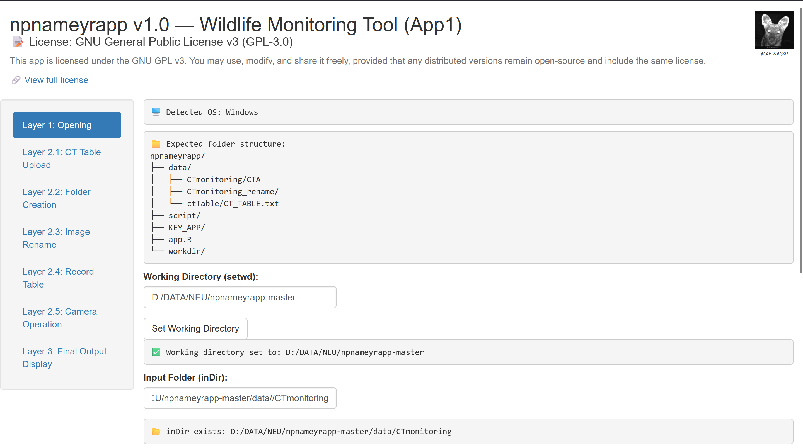

**CT Table Upload**
- Browse to `CT_TABLE.txt` located in `<working_directory>/data/ctTable`  

**Fig 2. App1 — Upload CT_TABLE.txt (layer input)**  
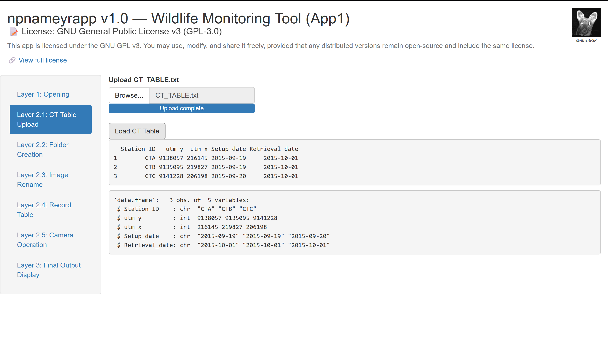

#### Outputs (saved to `excel_outdir`)
- Record Table  
- Camera Operation Matrix  
- Survey Report  
- `App1_output.RData`  

**Fig 3. App1 — Record_Table (layer processing result)**  
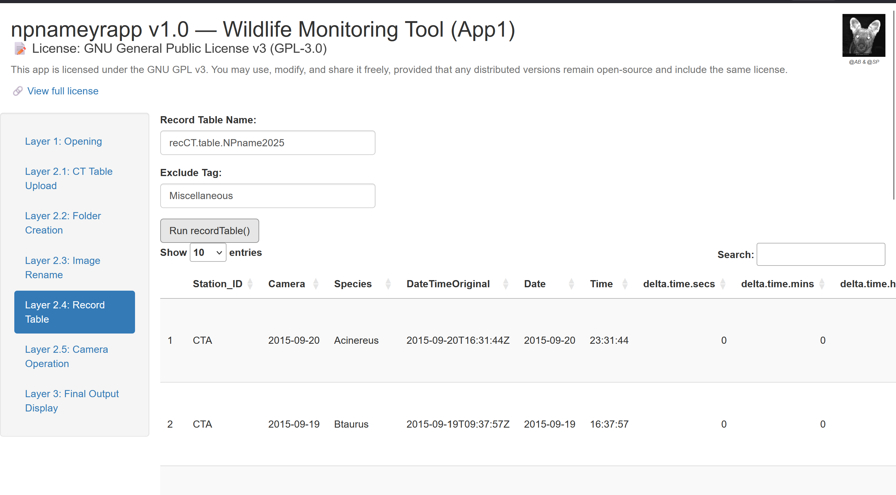

**Fig 4. App1 — SurveyReport (layer processing result)**  
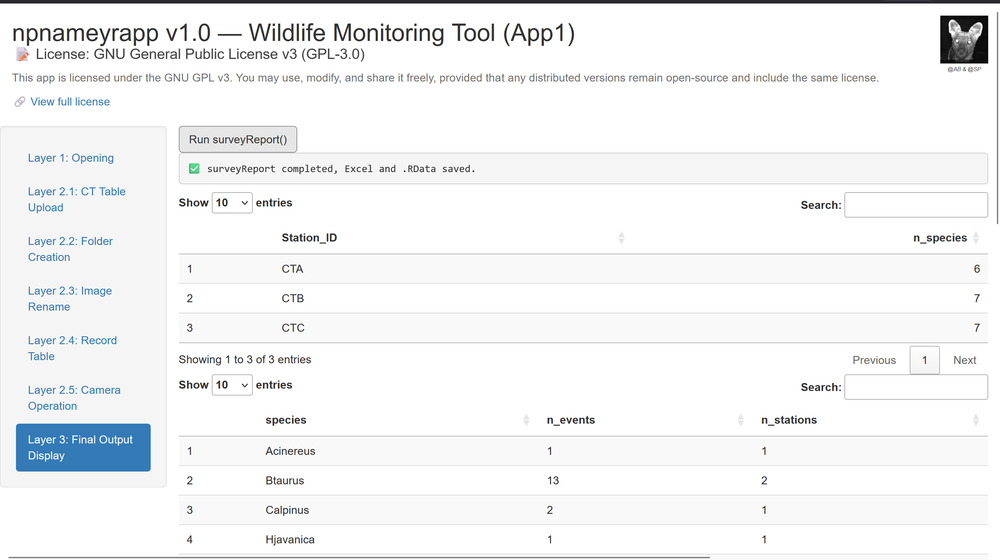

---

### App2

#### USER-INPUT Layers

**Opening**
- `setwd()` – confirm the working directory  
- `inDir` – `<working_directory>/workdir`  
- `outDir` – `<working_directory>/workdir/analysis`  

**Fig 5. App2 — Opening (layer input: PATH)**  
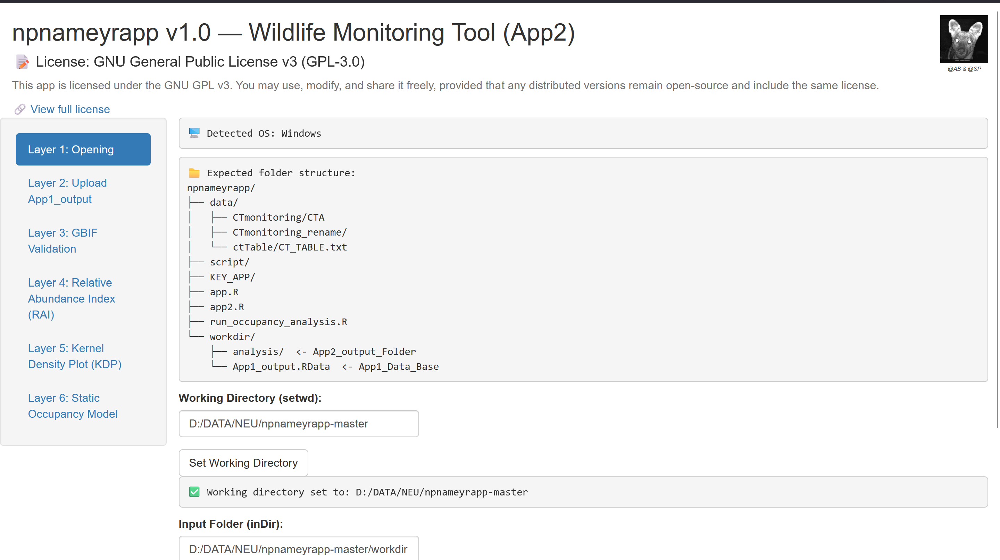

**Upload App1_output**
- Browse to `App1_output.RData` located in `<working_directory>/workdir`  

**Fig 6. App2 — Upload App1_output.RData (layer input)**  
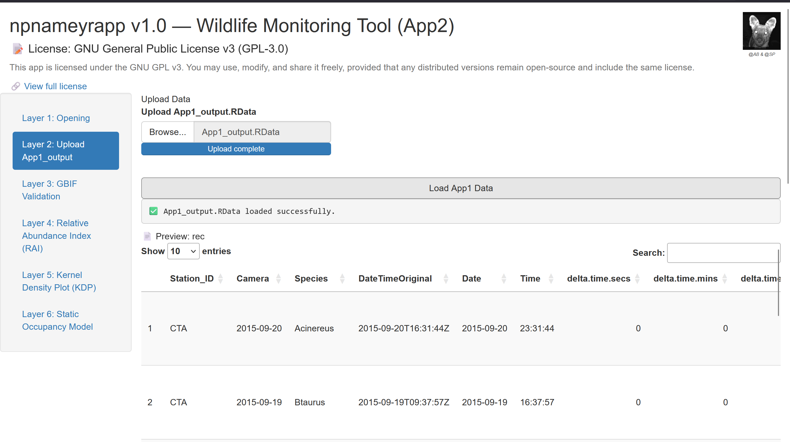

#### Outputs (saved to `outDir`)
- GBIF validation table  
- RAI table  
- Kernel Density Plot (PNG, 600 dpi resolution)  
- Static Occupancy Table  

**Fig 7. App2 — GBIF Validation (layer processing result)**  
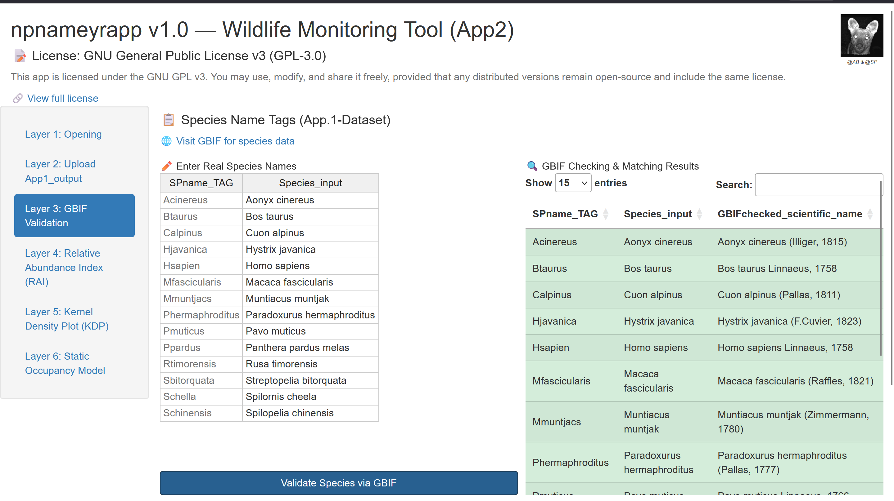

**Fig 8. App2 — Relative Abundance Index (layer processing result)**  
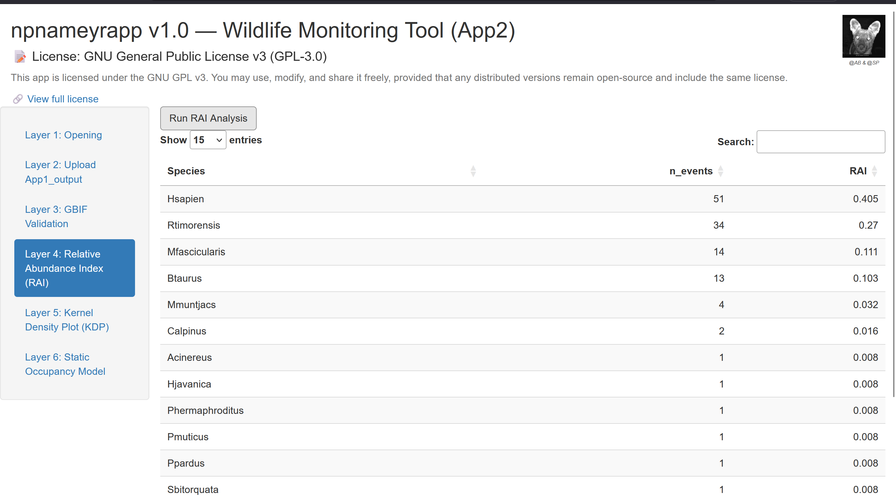

**Fig 9. App2 — Kernel Density Plot (layer processing result)**  
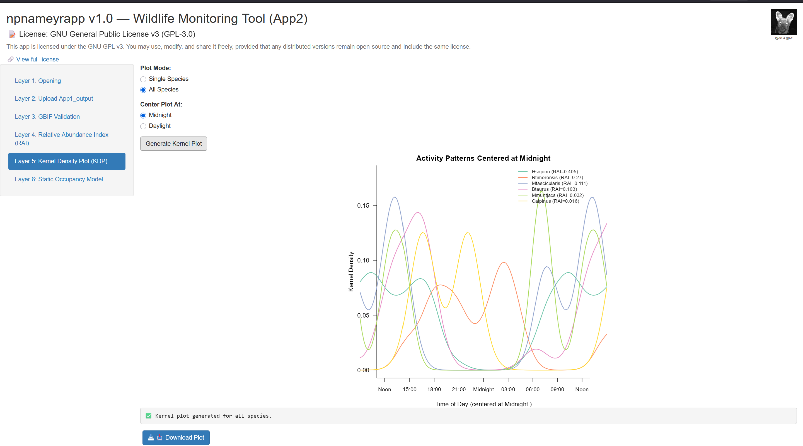

**Fig 10. App2 — Static Occupancy Model (layer processing result)**  
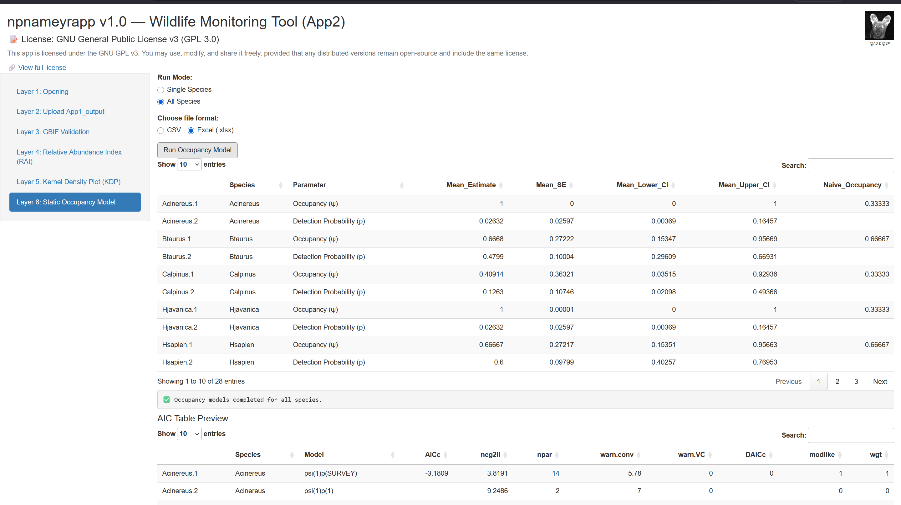

---

## Folder Structure

**Fig 11. Expected Folder Structure**  
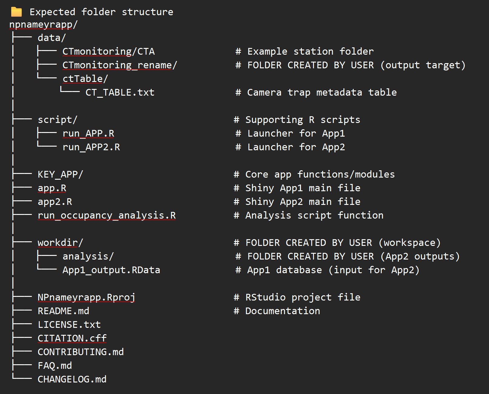

---

## Troubleshooting
Problem-solving discussions take place in the Google Group:
npshinyapp@googlegroups.com
All answers and troubleshooting guidance will be shared through this group.
Users may register or send an email address to be added as a member.

---

## References
- R Core Team. (2024). *R: A Language and Environment for Statistical Computing*. R Foundation for Statistical Computing, Vienna, Austria. [https://www.R-project.org/](https://www.R-project.org/)  
- Pudyatmoko, S., Budiman, A., & Siregar, A. H. (2023). *Habitat suitability of a peatland landscape for tiger translocation on Kampar Peninsula, Sumatra, Indonesia*. [https://doi.org/10.1007/s42991-023-00361-8](https://doi.org/10.1007/s42991-023-00361-8)  
- Pudyatmoko, S. (2017). *Free range livestock influence species richness, occupancy, and daily behaviour of wild mammalian species in Baluran National Park, Indonesia*. *Mammalian Biology*, 86, 33–41. [https://doi.org/10.1016/j.mambio.2017.04.001](https://doi.org/10.1016/j.mambio.2017.04.001)  
- Chang, W., Cheng, J., Allaire, J., Sievert, C., Schloerke, B., Xie, Y., Allen, J., McPherson, J., Dipert, A., & Borges, B. (2024). *shiny: Web Application Framework for R*. R package version 1.10.0. [https://CRAN.R-project.org/package=shiny](https://CRAN.R-project.org/package=shiny)  
- Niedballa, J., Sollmann, R., Courtiol, A., & Wilting, A. (2016). *camtrapR: An R package for efficient camera trap data management*. *Methods in Ecology and Evolution*, 7(12), 1457–1462.  
- Meredith, M., Ridout, M., & Campbell, L. A. (2024). *overlap: Estimates of Coefficient of Overlapping for Animal Activity Patterns*. R package version 0.3.9. [https://CRAN.R-project.org/package=overlap](https://CRAN.R-project.org/package=overlap)  
- MacKenzie, D., & Hines, J. (2025). *RPresence: R Interface for Program PRESENCE*. R package version 2.15.20.  

---

## License
This project is licensed under the GNU GPL v3.0.  
See [LICENSE.md](LICENSE.md) for details. 

